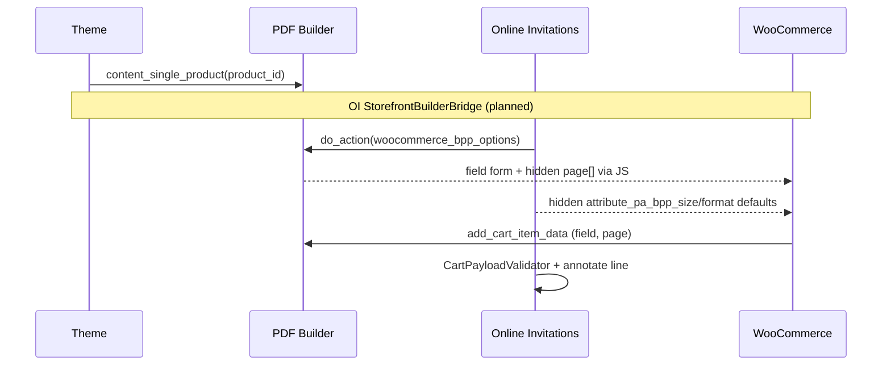
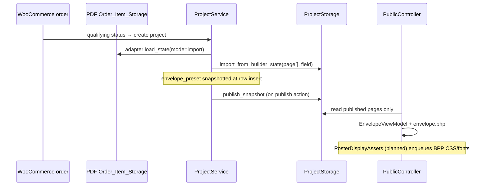

# Envelope + Poster — Integration Plan

**Date:** 2026-07-14  
**Status:** **Implemented (V1 envelope product configuration)**  
**Conclusion:** Envelope design is owned by Online Invitations; PDF Builder remains the inner poster designer only.

---

## V1 envelope product configuration (implemented)

### Product meta

| Key | Type | Purpose |
|-----|------|---------|
| `_pks_oi_envelope_preset` | slug | Animation/CSS shell (`classic`, `modern`, `minimal`) — **required** |
| `_pks_oi_envelope_image_id` | attachment ID | Optional explicit envelope card image (WordPress media library) |
| `_pks_oi_background_preset` | slug | Public page background (`neutral`, `floral`, `geometric`) — **required** |
| `_pks_oi_envelope_preview_ref` | string | **Deprecated** legacy admin note; no longer shown in product admin |

### Image resolution priority (`EnvelopeDesign::resolve_for_product`)

1. **Explicit** `_pks_oi_envelope_image_id` when set and attachment is a valid image.
2. **Preset-only** when no usable image exists (CSS envelope shell still renders).
3. **Gallery fallback** — first image in the WooCommerce product gallery (`get_gallery_image_ids()[0]`) when no explicit image is set.

**Gallery rules (documented):**

| Question | Answer |
|----------|--------|
| Which gallery image? | Index **0** only (first gallery image). |
| Featured image? | **Not used** for envelope; remains shop/catalog thumbnail. |
| Missing gallery / invalid attachment? | Envelope renders preset style without card image. |
| Gallery order changes? | Affects **new** purchases only. |
| Existing projects? | **Unchanged** — `envelope_image_id` snapshotted at project creation. |
| Invalid explicit attachment? | Product **not purchasable**; admin error shown. Invalid explicit IDs do **not** fall back to gallery. |

### Project snapshot (`pks_oi_projects`)

Schema v2 adds:

```text
envelope_image_id bigint unsigned NOT NULL DEFAULT 0
```

Frozen at `ProjectFactory::build_initial_row()` from resolved product design (including gallery fallback at purchase time).

### Product readiness (`BuilderValidity`)

Required before purchase/publish:

1. Active PDF Builder template (unless builder optional testing mode)
2. Resolvable BPP size/format defaults
3. Valid envelope preset
4. Valid background preset
5. Valid explicit envelope image attachment (when set)
6. WooCommerce price set
7. Product type `online_invitation`

Incomplete products: admin warning, publish blocked to draft, `woocommerce_product_is_purchasable` false, add-to-cart blocked.

### Admin UX

- Online Invitation product tab: envelope preset, media-library envelope image, background preset, live envelope preview.
- `wp_enqueue_media()` + `pks-oi-admin` JS for attachment picker.
- Readiness status badge on the same tab.

---

## 1. Target experience (V1)

```text
Admin
  → online_invitation WC product
  → envelope + background presets (OI product tab)
  → active _bpp_product design (PDF Builder admin)

Customer (pre-purchase)
  → product page: envelope NOT shown (only inner poster edited here)
  → PDF Builder canvas + field form
  → page[] + field[] → cart → order item file

Post-purchase
  → OI imports poster into project-owned storage
  → customer manages event/guests/RSVP in My Account

Public guest
  → /invitation/{token}/
  → animated envelope (project snapshotted preset)
  → open → published customer poster HTML
  → RSVP / wishlist / photos below poster
```

**Explicitly excluded from V1:** Reopening full PDF editor in My Account after purchase.

---

## 2. Responsibility matrix

| Concern | Owner | Storage | Lifetime |
|---------|-------|---------|----------|
| **WooCommerce product** | OI product type + WC admin | `product` post + meta | Until admin edits |
| **Envelope design** | **Online Invitations** | Preset slugs on product → snapshotted on project | Project row |
| **PDF Builder template** | **PDF module** | `_bpp_product` on same WC product | Admin edits; orders keep copy |
| **Customer poster HTML (editable)** | **PDF module** (capture) → **OI** (ownership) | `page[]` / `field` → project `pages/editable/` + `state/current.json` | Project |
| **Cart item** | WooCommerce + BPP + OI markers | WC session | Until checkout |
| **Order item** | BPP payload file + OI meta | `uploads/order-customized-items-data/*.text` + order item meta | Until cron cleanup; import copies |
| **Project storage** | **Online Invitations** | Private `projects/{uuid}/` tree | Project lifetime |
| **Published snapshot** | **Online Invitations** | `pages/published/`, `published/manifest.json` | Serves public traffic |
| **Public envelope renderer** | **Online Invitations** | Reads project `envelope_preset`, `background_preset`, `envelope_image_id` + published HTML | Per request |

**Theme:** Layout shell only — already calls `BPP_PDF_Plugin::content_single_product()`; must not own envelope/RSVP/guest logic.

**PDF module:** Inner designer + cart/order pipeline only; must not own envelope, project, or public routes.

---

## 3. Proposed data model

### 3.1 WooCommerce product meta (existing — no schema change)

| Key | Type | Example | Purpose |
|-----|------|---------|---------|
| `_pks_oi_envelope_preset` | string slug | `classic` | Public envelope style |
| `_pks_oi_background_preset` | string slug | `neutral` | Public page background |
| `_pks_oi_envelope_preview_ref` | string | admin note | Optional; not used in V1 runtime |
| `_pks_oi_default_locale` | string | `da_DK` | Default project locale |
| `_pks_oi_reminder_offset_days` | int | `5` | RSVP reminder |
| `_pks_oi_guest_photos_default` | bool meta | `yes` | Default project setting |
| `_pks_oi_wishlist_default` | bool meta | `yes` | Default project setting |
| `_bpp_product` | serialized | BPP model | PDF template (PDF module) |

### 3.2 Project row (existing — `pks_oi_projects`)

Copied at creation from product (`ProjectFactory::build_initial_row`):

```text
envelope_preset      varchar(64)   -- frozen from product
background_preset    varchar(64)   -- frozen from product
locale               varchar(20)
guest_photos_enabled tinyint
internal_wishlist_enabled tinyint
product_id           bigint        -- source WC product
template_id          varchar       -- V1: same as product_id
state_manifest_path  varchar       -- project files pointer
published_manifest_path varchar    -- after publish
```

Poster content **not** in DB — file-backed per `ProjectStorage`.

### 3.3 Project files (existing)

```text
projects/{storage_uuid}/
  state/current.json          -- field, size, format, schema, page index list
  pages/editable/page-001.html
  pages/editable/page-002.html   -- multi-page imports supported
  pages/published/page-001.html  -- V1: may contain combined multi-page HTML
  published/manifest.json
```

### 3.4 Order item payload (existing — PDF module)

```json
{
  "field": { "{uuid}": { "value": "...", "data": "data:image/...;base64,..." } },
  "page": ["<div class=\"customizer-page-content\">...</div>"],
  "_pages_thumbnails": ["..."],
  "meta": { "order_id": 0, "order_item_id": 0, "product_id": 0 }
}
```

### 3.5 Public view model (existing)

`EnvelopeViewModel` fields used by `templates/public/envelope.php`:

```text
envelope_preset, background_preset, addressee_label, invitation_html,
event_title, sections (rsvp|wishlist|photos), rsvp_form, wishlist, photos
```

No new tables or meta keys required for V1.

---

## 4. Data flow diagrams

### 4.1 Pre-purchase (storefront)



### 4.2 Post-purchase → public



---

## 5. Smallest remaining implementation

### 5.1 Priority P0 — OI only (no pdf-plugin, no theme)

#### A. `StorefrontBuilderBridge` (new class)

**Register from** `ProductTypeRegistrar::register()` alongside `BuilderIntegration`.

| Hook | Callback | Behavior |
|------|----------|----------|
| `woocommerce_before_add_to_cart_button` | `maybe_render_builder_fields()` | If `online_invitation` + `bpp/is_product_customizable` → `do_action('woocommerce_bpp_options')` |
| Same hook (or `woocommerce_before_add_to_cart_form`) | `maybe_render_size_format_defaults()` | If no variable attribute UI: read `BPP_Product` → output hidden `attribute_pa_bpp_size`, `attribute_pa_bpp_format` from `default_size` / `foldable` |

**Guards:**

- Skip if `ProductMeta::is_builder_optional()`
- Skip if not `is_product()` or not invitation product
- Use `BPP_Hooks::is_customized_product()` pattern via filter `bpp/is_product_customizable` — do not duplicate logic

**Evidence gap closed:** Q14, Q15, Q16 from current-state doc.

**Estimated size:** ~80–120 lines PHP + unit test.

#### B. `PosterDisplayAssets` (new class)

**Register from** `PublicController` or dedicated registrar.

On public invitation render only:

1. If `defined('BPP_PLUGIN_URLS')` → `wp_enqueue_style('bpp-public-css', BPP_PLUGIN_URLS . 'dist/css/public.css', ...)`
2. If `function_exists('BPP_fonts_css')` → `wp_add_inline_style` with returned font faces
3. Do **not** enqueue `public.dist.js`, cropper, jQuery UI

Optional: scoped wrapper CSS in `public.scss` for `.pks-oi-envelope__invitation .bpp-public-invitation` overflow.

**Evidence gap closed:** Q10, Q11.

**Estimated size:** ~60 lines PHP.

#### C. `ProductDataPanel` customize URL fix

Change line 45:

```php
// Current (likely wrong param):
admin_url( 'admin.php?page=bpp-customize&product_id=' . $product_id );
// BPP expects:
admin_url( 'admin.php?page=bpp-customize&prdid=' . $product_id );
```

Verify against `BPP_Controller::customize()` in pdf-plugin.

**Estimated size:** 1 line + optional test.

### 5.2 Priority P1 — Operations / QA (no code)

1. On product **284185** (or new product):
   - Set type `online_invitation`
   - Configure envelope `classic` + background `neutral`
   - Open PDF Builder customizer → save active `_bpp_product` (clone from variable invitation e.g. 263195)
2. Run `docs/online-invitation-runtime-test-plan.md` §3

### 5.3 Priority P2 — Optional improvements (not V1 blockers)

| Item | Owner | Notes |
|------|-------|-------|
| Split adapter publish into per-page files | OI | `ProjectPublishService::render_public_pages()` — fallback path already multi-page |
| `ENVELOPE_PREVIEW_REF` admin media picker | OI | V2 — currently unused |
| Dedicated public “Event details” section | OI | Event title on envelope card only today |
| Theme `simple.php` hook | Theme | **Avoid** if OI bridge ships — prevents duplicate fields |

### 5.4 Explicitly NOT in scope

- pdf-plugin `Editor_Renderer` field form for My Account
- pdf-plugin `enqueue_public_assets` adapter method (OI can call globals)
- Rebuilding PDF Designer
- Envelope inside PDF `page[]` HTML
- Guest-capacity packages

---

## 6. Proposed file change list

### 6.1 New files (Online Invitations)

| File | Purpose |
|------|---------|
| `src/WooCommerce/ProductType/StorefrontBuilderBridge.php` | Field form + size/format defaults on simple product |
| `src/Public/PosterDisplayAssets.php` | BPP public CSS + fonts on invitation route |
| `tests/Unit/WooCommerce/StorefrontBuilderBridgeTest.php` | Hook guards, no duplicate output |
| `tests/Unit/Public/PosterDisplayAssetsTest.php` | Enqueue when BPP available |

### 6.2 Modified files (Online Invitations)

| File | Change |
|------|--------|
| `src/WooCommerce/ProductType/ProductTypeRegistrar.php` | Register `StorefrontBuilderBridge` |
| `src/Public/PublicController.php` | Call `PosterDisplayAssets::enqueue()` in `enqueue_assets()` |
| `src/WooCommerce/ProductType/ProductDataPanel.php` | Fix `prdid` customize URL |
| `assets/src/scss/public.scss` | Optional poster viewport scaling inside envelope |
| `docs/builder-integration.md` | Document storefront bridge (after implement) |

### 6.3 Theme changes

**None required** for V1 if OI `StorefrontBuilderBridge` ships.

Alternative (if product team prefers theme ownership):

| File | Change |
|------|--------|
| `woocommerce/single-product/add-to-cart/simple.php` | `do_action('woocommerce_bpp_options')` when customizable |

**Recommendation:** OI hook — keeps presentation logic out of theme, satisfies rule #9.

### 6.4 pdf-plugin changes

**None required** for V1.

| Possible optional change | Unavoidable? | Why skip |
|------------------------|--------------|----------|
| `enqueue_public_assets()` on adapter | No | OI calls `BPP_fonts_css()` + enqueues CSS URL |
| JS selector `.bpp-pdf-plugin-add-to-cart` fix | No | BPP hides default WC button; min-qty mismatch low impact when qty=1 |
| Simple-product hook in BPP | No | OI can fire `woocommerce_bpp_options` |

---

## 7. Hook inventory (planned additions only)

| Hook | Plugin | Priority | Callback |
|------|--------|----------|----------|
| `woocommerce_before_add_to_cart_button` | OI | 10 | `StorefrontBuilderBridge::maybe_render_builder_fields` |
| `woocommerce_before_add_to_cart_button` | OI | 5 | `StorefrontBuilderBridge::maybe_render_size_format_defaults` |

**No hooks removed.** Existing BPP hooks unchanged. Variable products unaffected.

---

## 8. Test plan (post-implementation)

```bash
composer test   # prikogstreg-online-invitations — must stay green
composer test   # pdf-plugin — regression
```

Add:

- Unit: bridge skips non-invitation, skips builder-optional, fires `woocommerce_bpp_options` once
- Unit: poster assets enqueues only when BPP constants/functions exist
- Integration: existing `CartCheckoutTest` still passes
- Manual: `online-invitation-runtime-test-plan.md` §3 steps 1–12 (product customize + cart)

---

## 9. Risk register

| Risk | Mitigation |
|------|------------|
| Duplicate field form if theme later adds hook | Document single owner (OI); grep before theme edits |
| Large `page[]` POST failures | Document hosting limits; existing `StorageLimits` / adapter validation |
| Public fonts missing | `PosterDisplayAssets` + manual visual QA |
| Multi-page poster layout on mobile | CSS viewport wrapper in `public.scss` |
| `BPP_fonts_css` uses font `slug` — `get_fonts()` returns `name` | Pre-existing PDF quirk; verify at runtime; fix in PDF only if fonts actually break |

---

## 10. Preserve existing behavior

| Rule | How plan respects it |
|------|---------------------|
| Variable PDF products unchanged | Bridge runs only for `online_invitation` |
| Physical products unchanged | Type guard |
| Classic checkout | No Blocks work |
| Qty = 1 | Existing `QuantityGuard` untouched |
| HPOS | No direct post queries added |
| No raw draft HTML public | Unchanged `PublicInvitationLoader` |
| Minimal pdf-plugin touch | Zero pdf-plugin files in change list |

---

## 11. Implementation sequence

```text
1. StorefrontBuilderBridge + tests
2. PosterDisplayAssets + tests
3. ProductDataPanel prdid fix
4. composer test (both plugins)
5. Admin: configure online_invitation + active _bpp_product
6. Manual E2E: customize → checkout → import → publish → public envelope
7. Optional: public.scss poster viewport tweak after visual QA
```

---

## 12. Final conclusion

### **Small Online Invitations changes are required.**

Rationale:

- **Envelope + public shell + project snapshot + import/publish pipeline already exist** in OI (not “configuration only”).
- **PDF Builder inner designer works** for the established variable-product path and canvas renders for `online_invitation` when `_bpp_product` is active.
- **Two small OI gaps block V1:** storefront field form / defaults (Q14–16) and public BPP CSS/fonts (Q10–11).
- **Theme changes are not required** if OI adds `StorefrontBuilderBridge`.
- **pdf-plugin changes are not unavoidable** — reuse `woocommerce_bpp_options`, `BPP_fonts_css()`, and `BPP_PLUGIN_URLS` from OI.

After P0 code + product configuration + manual QA, the intended envelope-wrapped customer poster flow should be complete without rebuilding the PDF Designer.

---

## 13. Post-task report template (for implementation prompt)

When implementation runs, report:

- Findings (delta from this document)
- Files created / changed
- Hooks added
- Tests executed + results
- Remaining manual QA
- pdf-plugin changes (expected: **none**)
