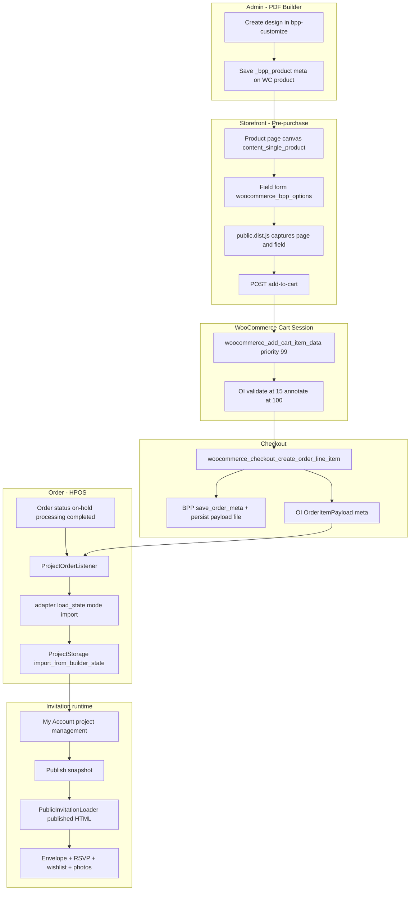

# Online Invitation — Data Flow

**Audit date:** 2026-07-14  
**Scope:** Browser form → cart → checkout → order item → project import → public display

---

## 1. End-to-end overview



---

## 2. Phase 4 — Product form → cart

### 2.1 HTTP POST fields (add-to-cart)

| Field | Source | Cart key | Evidence |
|-------|--------|----------|----------|
| `page[]` | Hidden inputs — browser-generated HTML per page | `$cart_item_data['page']` | `class-bpp-woo-cart-functions.php:29` |
| `field[uuid][…]` | Text values, layer toggles, image data | `$cart_item_data['field']` | lines 32-38 |
| `field[uuid][data]` (file) | Customer image upload → base64 | merged into field | lines 42-58 |
| `attribute_pa_bpp_size` | Variation/size UI | `pa_bpp_size` | line 28 |
| `attribute_pa_bpp_format` | Format UI | `pa_bpp_format` | line 27 |
| `bpp-pdf-files` | Preview PDF paths from AJAX | `pdf-files` | line 26 |
| `quantity` | WC form | WC core | theme `simple.php` |
| `add-to-cart` | Product ID | WC core | — |

**OI additions (annotation only at add-to-cart):**

| Marker | Purpose | Evidence |
|--------|---------|----------|
| `pks_oi_invitation` | Line type flag | `CartPayload.php` |
| `pks_oi_payload_version` | Schema version | `InvitationCart.php:51-61` |
| `pks_oi_payload_checksum` | Integrity marker | `CartPayloadValidator.php` |

Full builder blob remains in cart session via BPP keys — OI stores checksum, not duplicate HTML in DB tables.

### 2.2 Cart pipeline hooks

```text
woocommerce_add_cart_item_data (priority 15)
  → OI CartPayloadValidator::validate_posted_payload()
      → adapter validate_state(mode=cart)

woocommerce_add_cart_item_data (priority 99)
  → BPP_Woo_Cart_Functions::add_cart_item_data()
      → skip if !BPP_Product.active

woocommerce_add_cart_item_data (priority 100)
  → OI InvitationCart::annotate_invitation_line()

woocommerce_get_cart_item_from_session
  → OI InvitationCart::restore_from_session()
```

### 2.3 Cart uniqueness

WooCommerce distinguishes cart lines by hash of `woocommerce_add_cart_item_data` return value. Different `field`/`page` content → separate lines.

**Guest capacity:** Not in cart key (not implemented).

**Quantity:** OI normalizes to 1 on add (`QuantityGuard::normalize_added_quantity`).

### 2.4 Cart size / session risks

| Risk | Status | Notes |
|------|--------|-------|
| Raw HTML in `page[]` | **Proven pattern** | Multi-page + inline styles |
| Base64 images in `field` | **Proven pattern** | Can exceed MB per line |
| `post_max_size` / `upload_max_filesize` | **Probable problem** | Hosting-dependent |
| WC session serialization | **Probable problem** at extreme sizes | Manual test required |
| Script injection in `page[]` | **Unsafe input** — unslashed, not kses'd at capture | `wp_unslash` only |

### 2.5 Checkout Blocks

**Not supported** for invitation carts — `CheckoutBlockGuard` redirects/errors.

**Classic checkout:** Production path (runtime verified).

---

## 3. Phase 5 — Checkout → order item

### 3.1 Order line item hooks

```text
woocommerce_checkout_create_order_line_item (priority 10)
  ├─ BPP_Hooks::save_order_meta()
  │     → copies field, page, thumbnails, pa_bpp_* to order item meta (transitional)
  ├─ BPP_Woo_Cart_Functions::ks_add_custom_fields_to_order_item_meta()
  │     → human-readable labels
  ├─ Bpp_cart_pdf_handler::save_pdf_files_order_item_meta()
  │     → _pdf_files
  └─ OI OrderItemPayload::persist_invitation_references()
        → _pks_oi_product_type, _pks_oi_payload_version, _pks_oi_payload_checksum

woocommerce_new_order_item (priority 20)
  └─ BPP_Hooks::persist_order_item_payload_to_file()
        → BPP_Order_Item_Storage::save_payload()
```

### 3.2 Filesystem payload schema

**Path pattern:**

```text
wp-content/uploads/order-customized-items-data/{Y}/{m}/{order_id}-{order_item_id}-{product_id}.text
```

**File contents (normalized JSON):**

```json
{
  "field": {
    "{uuid}": {
      "value": "Customer text",
      "data": "data:image/jpeg;base64,..."
    }
  },
  "page": [
    "<div class=\"customizer-page-content\">...</div>"
  ],
  "_pages_thumbnails": ["https://example.com/..."],
  "meta": {
    "order_id": 1001,
    "order_item_id": 55,
    "product_id": 456,
    "updated_at": "2026-07-14T10:00:00+00:00"
  }
}
```

**Evidence:** `BPP_Order_Item_Storage::save_payload()` lines 52-62

**Order item meta pointers:**

| Meta key | Value |
|----------|-------|
| `_bpp_custom_data_file` | Relative path under uploads |
| `_bpp_custom_data_version` | `"1"` |
| `_pks_oi_project_id` | Set after project creation |
| `_pks_oi_product_type` | `online_invitation` |

Legacy `field`/`page` meta deleted after file write (lines 77-80).

### 3.3 Recoverability checklist

| Data | Recoverable | Source |
|------|-------------|--------|
| Complete poster HTML | Yes | `page[]` in payload file |
| Field state | Yes | `field` in payload file |
| All pages | Yes | `page` array |
| Thumbnails | Yes | `_pages_thumbnails` |
| Dimensions/format | Partial | `pa_bpp_size` / `pa_bpp_format` order meta; may be empty on simple products |
| Product ID | Yes | payload `meta.product_id` + order item |
| Order / item IDs | Yes | payload `meta` + WC CRUD |
| Guest capacity | **No** | not stored |
| Customer ID | Yes | order `get_customer_id()` |

### 3.4 HPOS

Order access via `wc_get_order()` — OI and BPP storage use order item IDs (HPOS-safe).

PDF cron cleanup queries both HPOS and legacy tables (`class-bpp-cron.php:160-228`).

### 3.5 Cleanup / retention

| Job | Effect | OI impact |
|-----|--------|-----------|
| `bpp_delete_old_order_meta` | Removes order item meta incl. `_bpp_custom_data_file` pointer for orders > ~3 months | **Project must import before cleanup** |
| Project files | Independent of order payload after import | Long-term source |

---

## 4. Phase 6 — Order payload reader

### 4.1 `BPP_Order_Item_Storage::get_payload()`

| Question | Answer | Evidence |
|----------|--------|----------|
| Public API? | **De facto internal** — global class, no interface | class definition |
| Callable by OI? | **Yes** — via adapter `load_state(mode=import)` | `Online_Invitation_Builder_Adapter.php:97` |
| Arguments | `(int) $order_item_id` | line 91 |
| Missing file | Returns empty arrays (legacy meta fallback) | lines 103-129 |
| Malformed JSON | Falls through to empty/legacy | lines 108-117 |
| Directory traversal | Relative path from meta concatenated to uploads basedir — **trusts meta** | line 105 |
| Ownership check | **None** in storage class | — |
| OI must validate order ownership | **Yes** before import | `ProjectService` uses order from WC |

### 4.2 Recommended V1 bridge (implemented)

```text
OI ProjectService::import_for_project()
  → validates order + order_item + customer
  → BuilderService → adapter load_state([
        mode: 'import',
        order_item_id: …,
        order_id: …,
        product_id: …,
     ])
  → BPP_Order_Item_Storage::get_payload()
  → State_Normalizer → validate → migrate
  → ProjectStorage::import_from_builder_state()  [OI-owned copy]
```

**Normal runtime does not re-read order file** — adapter returns `WP_Error` for non-import modes (`Online_Invitation_Builder_Adapter.php:88-90`).

### 4.3 Smallest safe integration surface

1. `apply_filters('bpp/integration/service')` — read-only import + render
2. `bpp/is_product_customizable` — storefront eligibility
3. Existing cart/checkout hooks — unchanged
4. Direct `BPP_Order_Item_Storage` — **only** inside PDF adapter, not scattered in OI

---

## 5. Phase 8 — Project-owned storage (post-import)

```text
{PKS_OI_STORAGE_PATH}/projects/{storage_uuid}/
  manifest.json
  state/current.json          ← canonical field/size/format/schema
  pages/editable/page-001.html
  pages/published/page-001.html   ← after publish
  published/manifest.json
```

**Import:** `ProjectStorage::import_from_builder_state()` splits `page[]` into files, writes manifest with checksums.

**Public:** `PublicInvitationLoader` reads **published** pages only, runs `PublishedHtmlSanitizer`, optional adapter wrap.

**Dependency removal:** Published invitation can work with PDF plugin disabled **after successful import + publish** — **runtime test required** for font CSS.

---

## 6. Phase 9 — Static public rendering (design)

```text
Public route /invitation/{token}/
  → PublicController
  → PublicInvitationLoader::load_published_content()
      → read published/manifest.json + page HTML files
      → PublishedHtmlSanitizer (script/on* / javascript: strip)
      → optional adapter wrap_public_html
  → templates/public/invitation.php (envelope shell)
  → NO public.dist.js editor bundle required
```

**Required assets for fidelity (expected):**

| Asset | Required? | Notes |
|-------|-----------|-------|
| `public.css` (BPP) | **Likely yes** | Layout/fonts for poster dimensions |
| `BPP_fonts_css()` output | **Likely yes** | Custom fonts from `bpp_font` CPT |
| `public.dist.js` | **No** for display | Editor only |
| Fitty/textFit | **No** after save | Text already fitted in HTML |
| Cropper/jQuery UI | **No** | Display only |

**Recommended V1 approach:** Scoped container (`.pks-oi` + `.bpp-public-invitation`) with sanitized HTML inline — **not** iframe unless CSP forces it. Iframe improves isolation but hurts font inheritance and responsive scaling.

---

## 7. Data ownership summary

| Stage | Owner | Lifetime |
|-------|-------|----------|
| Product template `_bpp_product` | PDF Builder | Until admin changes product |
| Cart session builder data | WooCommerce session | Until order placed |
| Order-item `.text` file | PDF Builder | Until cron cleanup (~3 months meta; file may remain) |
| Project `pages/` + `state/` | Online Invitations | Project lifetime |
| Published snapshot | Online Invitations | Serves public traffic |
| RSVP/guests/photos | Online Invitations | Project lifetime |

---

*Payload example is sanitized/structural — do not commit real customer PII or base64 blobs to docs.*
