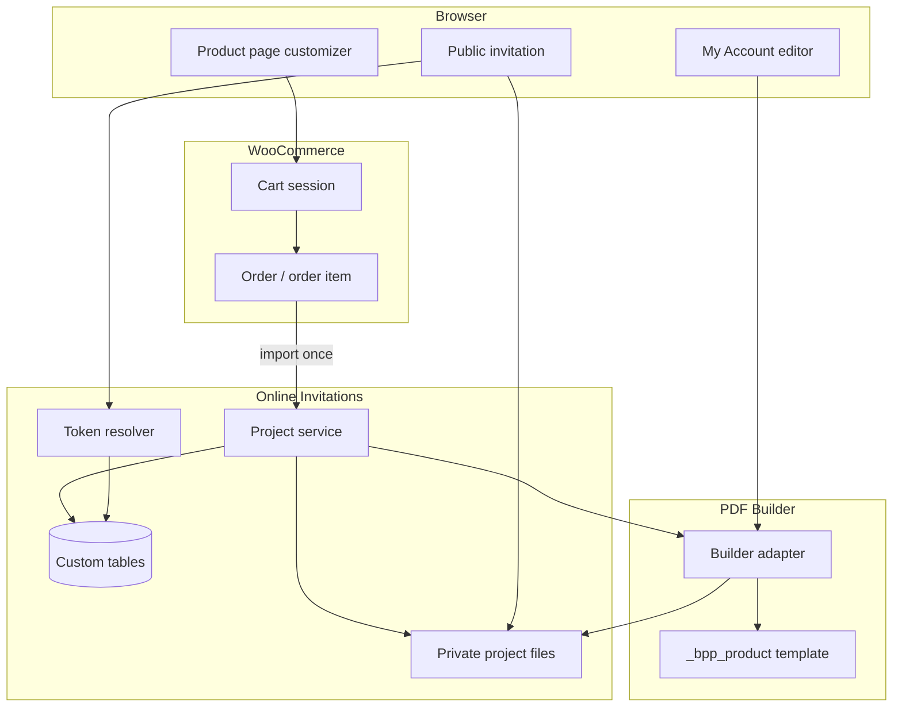
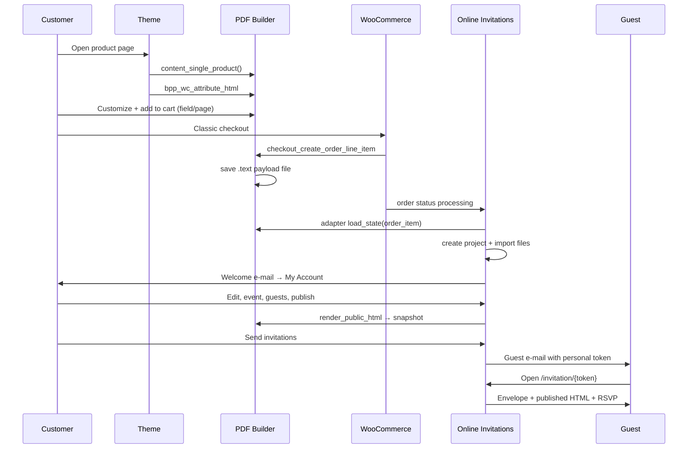

# Technical plan — Prikogstreg Online Invitations

**Status:** Authoritative (Prompt 1)  
**Date:** 2026-07-14  
**Evidence basis:** Repository inspection of `pdf-plugin`, `prikogstreg-online-invitations` (empty implementation), `prikogstreg` theme, WooCommerce 10.8.1, WordPress 7.0 workspace.

**Related documents:**

- `architecture-decisions.md`
- `database-schema.md`
- `builder-integration.md`
- `security-review.md`
- `privacy-retention.md`
- `test-plan.md`
- `pdf-plugin/docs/online-invitation-integration-audit.md`
- `pdf-plugin/docs/online-invitation-integration-contract.json`

---

## 1. Architecture summary

Prikogstreg Online Invitations is a new WooCommerce plugin registering product type `online_invitation`. Customers customise a fixed invitation design on the product page using the **existing PDF Builder** pre-purchase flow. After checkout reaches a qualifying order status, the plugin creates a **private invitation project** (CPT shell + custom tables + private files). The customer manages guests, RSVP, wishlist, photos, and publication in **WooCommerce My Account**. Guests access an **animated envelope** public experience via opaque bearer tokens.

Integration with the PDF Builder is **only** through `apply_filters( 'bpp/integration/service', null )` implementing `BPP\Integration\Builder_Adapter_Interface`. The order item remains the purchase audit source; **project-owned file storage** is the long-term editable source.



---

## 2. Repository state (2026-07-14)

| Repository | Path | State |
|------------|------|-------|
| PDF Builder | `wp-content/plugins/pdf-plugin/` | Production customizer; v1.0; integration adapter pending (Prompts 4–6 specs only) |
| Online Invitations | `wp-content/plugins/prikogstreg-online-invitations/` | **v0.1.0 (Prompt 19)** — Wishlist, atomic guest reservations |
| Active theme | `wp-content/themes/prikogstreg/` | Integrates PDF Builder on single product |
| Live theme mirror | `wp-content/themes/prikogstreg--live/` | Same BPP integration paths |
| Integration audit | `pdf-plugin/docs/online-invitation-integration-audit.md` | Complete |
| Agent handbook | `prikogstreg-online-invitations/.cursor/agent.md` | Complete |

### Online Invitations foundation (Prompts 7–16 — implemented)

| Item | Value |
|------|-------|
| Plugin version | `PKS_OI_VERSION` = `0.1.0` |
| Database schema version | `PKS_OI_DB_VERSION` = `1` (`Schema::CURRENT_VERSION`) |
| Namespace | `PrikOgStreg\OnlineInvitations\` |
| Main file | `prikogstreg-online-invitations.php` |
| Boot | `Requirements` → `Plugin::boot()` |
| Private CPT | `pks_oi_project` (`Admin\ProjectPostType`) — not publicly queryable |
| Capabilities | `pks_oi_manage_own_projects` (customer), `pks_oi_support_projects` (admin/shop manager) |
| Database | `Database\Schema`, `Migrator`, `MigrationLock`, `DatabaseBootstrap` |
| Repositories | Eight table repositories via `Database\RepositoryRegistry` |
| CPT deletion | `Database\ProjectDomainCleanup` — DB rows + `ProjectStorage::delete_project_storage()` |
| File storage | `Storage\*` — `StoragePath`, `ProjectStorage`, manifests, atomic writes, diagnostics (`docs/storage.md`) |
| Product type | `WooCommerce\ProductType\*` — `online_invitation`, admin panel, `QuantityGuard`, `BuilderValidity` |
| Cart/checkout | `WooCommerce\Cart\*`, `Checkout\*` — payload markers, validation, account requirement (`docs/checkout-integration.md`) |
| Project creation | `Domain\Project\*`, `WooCommerce\Orders\*` — order-status listener, import, welcome scaffold (`docs/project-creation.md`) |
| My Account | `MyAccount\*`, `Security\Authorization`, `Api\ProjectRestController` — editor, event, preview, publish, demo (`docs/my-account.md`) |
| Project lifecycle | `Domain\Project\ProjectStateService`, `ProjectEventService`, `ProjectPreviewService`, `ProjectPublishService`, `DemoInvitationService` |
| Public invitation | `Public\*`, `Security\InvitationToken`, `GuestTokenService`, `GenericTokenService` (`docs/public-invitation.md`) |
| Guests & address book | `GuestService`, `GuestCsv`, `GuestImportService`, `AddressBookService`, `GuestController`, `AddressBookController` (`docs/guest-management.md`) |
| RSVP & responses | `RsvpService`, `RsvpController`, `ResponsesController`, `DeliveryQueueService` (`docs/rsvp.md`) |
| E-mail delivery | `DeliverySendService`, WC e-mails, `ReminderScheduler`, `WelcomeScheduler` (`docs/email-delivery.md`) |
| Wishlist | `WishlistItemService`, `WishlistReservationService` (`docs/wishlist.md`) |
| PDF Builder discovery | `BuilderService` → `apply_filters( 'bpp/integration/service', null )` |
| Missing adapter | Admin notice; features disabled; no fatal |
| Migration failure | Admin notice via `Migrator::OPTION_MIGRATION_ERROR` |
| HPOS | `WooCommerce\Compatibility` declares `custom_order_tables` |
| Action Scheduler | Checked via `Requirements::action_scheduler_available()` |
| Templates | `Support\TemplateLoader` with allowlist |
| Assets | Source `assets/src/` → build `assets/build/` (esbuild + sass) |
| Uninstall | Preserves data unless `PKS_OI_UNINSTALL_DELETE_DATA` |

**Commands verified (2026-07-14):**

```bash
composer validate          # OK
composer dump-autoload -o  # OK
composer test              # 91 tests — OK
npm run build              # assets/build/* generated
```

---

## 3. PDF Builder — located components

| # | Component | Evidence path |
|---|-----------|---------------|
| 1 | Bootstrap | `pdf-plugin/index.php` → `BPP_PDF_Plugin::init()` |
| 2 | Template storage | Product meta `_bpp_product` — `src/class-bpp-product.php` |
| 3 | Cart payload | `src/class-bpp-woo-cart-functions.php` — `woocommerce_add_cart_item_data` |
| 4 | Order-item storage | `src/class-bpp-order-item-storage.php` — `.text` files under `uploads/order-customized-items-data/` |
| 5 | Product-page renderer | `BPP_PDF_Plugin::content_single_product()` — `src/class-bpp-pdf-plugin.php:330` |
| 6 | Frontend bundles | `dist/js/public.dist.js`, `dist/css/public.css` — Webpack from `assets/js/public.js` |
| 7 | AJAX handlers | `src/class-bpp-hooks.php`, `src/class-bpp-cart-pdf-handler.php`, `src/class-bpp-order-item-customizer.php` |
| 8 | PDF generation | `src/class-bpp-pdf-generator.php` — mPDF 8.0.14 |
| 9 | Fonts | CPT `bpp_font`, option `bpp-fonts`, `BPP_fonts_css()` in `functions.php` |
| 10 | Theme dependencies | See §4 |

### Cart/order payload shape

See `builder-integration.md` §2. Keys: `field`, `page`, `pa_bpp_size`, `pa_bpp_format`, `pdf-files`.

---

## 4. Theme integration (evidence)

### `BPP_PDF_Plugin::content_single_product()`

```60:64:wp-content/themes/prikogstreg/woocommerce/content-single-product.php
			if (class_exists('BPP_PDF_Plugin')) {
				BPP_PDF_Plugin::content_single_product($postID);
			} else {
				do_action( 'woocommerce_before_single_product_summary' );
```

Duplicate in `prikogstreg--live/woocommerce/content-single-product.php:61`.

### `bpp_wc_attribute_html`

```62:63:wp-content/themes/prikogstreg/woocommerce/single-product/add-to-cart/variable.php
			echo apply_filters( 'bpp_wc_attribute_html', $attribute_html, $product, $attributes ); 
```

Filter callback: `BPP_Hooks::bpp_wc_attribute_html` — `pdf-plugin/src/class-bpp-hooks.php:790`.

Template partial: `pdf-plugin/templates/public/customized-product-attribute-html.php` (fires `woocommerce_bpp_options`).

### `ks_render_custom_field_meta()`

**Present** in theme — `wp-content/themes/prikogstreg/functions.php:95`.  
Called from `pdf-plugin/src/class-bpp-woo-cart-functions.php:86,131` without `function_exists` guard.

### `get_product_min_order_quantity()`

**Present** in theme — `wp-content/themes/prikogstreg/core/woocommerce.php:790`.  
Used in `pdf-plugin/templates/public/add-to-cart-button-html.php:7`.

**Online invitation note:** V1 forces quantity 1; min-order logic must not override invitation lines (Prompt 10 `QuantityGuard`).

---

## 5. Checkout type

| Evidence | Conclusion |
|----------|------------|
| Theme `page-checkout.php` — Template Name: **Kasse v2** | Custom classic checkout page |
| `woocommerce/checkout/form-checkout.php` overridden (v3.5.0) | Classic WC checkout form |
| `.bowe-checkout` layout in `page-checkout.php`, `checkout.scss` | Custom classic UI |
| No `woocommerce/checkout` block in theme templates | **No Checkout Block evidence** |
| PDF Builder uses `woocommerce_checkout_create_order_line_item` | Classic pipeline compatible |
| No Store API / Blocks bridge in pdf-plugin | Blocks **not supported** without new work |

**Decision:** Implement **classic checkout** as primary (ADR-009). Checkout Block checkout is **blocked** for invitation carts until a Store API bridge exists — see `docs/checkout-integration.md`.

**Manual verification still required:** Confirm WooCommerce → Settings → Checkout page is `page-checkout.php` (Kasse v2) on production.

---

## 6. HPOS and Action Scheduler

### HPOS

| Item | Status |
|------|--------|
| Online Invitations order access | **Must use** `wc_get_order()`, order item CRUD only |
| PDF Builder HPOS declaration | **Not declared** in plugin header |
| PDF Builder cron | **HPOS-aware** — queries `wp_wc_orders` and legacy `wp_posts` — `src/class-bpp-cron.php:154-246` |
| Direct `wp_posts` order queries in OI | **Forbidden** |

### Action Scheduler

| Item | Evidence |
|------|----------|
| Availability | Bundled with WooCommerce 10.8.1 |
| Version | 3.9.3 — `woocommerce/packages/action-scheduler/action-scheduler.php` |
| Usage | `as_schedule_single_action`, `as_unschedule_action`, group `pks-oi` |

---

## 7. Project creation and import

See sequence diagram §20. Import steps:

1. `BPP_Order_Item_Storage::get_payload( $order_item_id )`
2. Adapter `load_state()` + `validate_state()`
3. `ProjectStorage::import_from_builder_state()` — atomic file write
4. `wc_update_order_item_meta( $item_id, '_pks_oi_project_id', $project_id )`

Qualifying statuses: `on-hold`, `processing`, `completed`. Idempotent via `order_item_id` UNIQUE.

---

## 8. Private storage strategy

See **`docs/storage.md`** for implementation details.

| Priority | Root | Access |
|----------|------|--------|
| 1 (preferred) | `PKS_OI_STORAGE_PATH` constant — outside web root | PHP-only |
| 2 (fallback) | `wp-content/uploads/pks-oi-private/` | `.htaccess` deny + PHP streaming |

Layout: `{root}/projects/{storage_uuid}/` — see `architecture-decisions.md` ADR-010 and `agent.md` §15.

### Atomic write flow

```text
1. Validate state (adapter) + ownership (OI)
2. Write to tmp/{basename}.{pid}.tmp
3. fflush + sha256 checksum
4. rename() to target (pages/editable/, state/current.json)
5. Update manifest.json + increment state_version in DB
6. Preserve previous.json until new write verified
7. On conflict (stale state_version): HTTP 409 to client
```

---

## 9. Project and publication states

### Domain status (`pks_oi_projects.status`)

`draft` → `active` → (`restricted` | `expired` | `archived`) → `deleted`

### Publication (`publication_status`)

`unpublished` ↔ `published` (independent of draft/active)

Public resolver requires: `status=active`, `publication_status=published`, valid entitlement, `effective_expiry > now`, published manifest checksum valid.

### No event date

Publication **blocked** until event start/end set. Expiry job skips until date exists. See `privacy-retention.md` §5.

---

## 10. My Account routes

| Route | Controller | Ownership check |
|-------|------------|-----------------|
| `/my-account/online-invitations/` | `ProjectController::list` | `user_id` |
| `.../online-invitations/{id}/` | `ProjectController::overview` | `ProjectRepository::owned_by` |
| `.../design/` | `ProjectController::design` | + adapter |
| `.../event/` | `ProjectController::event` | |
| `.../guests/` | `GuestController` | |
| `.../address-book/` | `AddressBookController` | user scope |
| `.../preview/` | `ProjectController::preview` | no open tracking |
| `.../publish/` | `ProjectController::publish` | entitlement |
| `.../responses/` | `GuestController::responses` | |
| `.../wishlist/` | `WishlistController` | |
| `.../photos/` | `PhotoController` | |
| `.../settings/` | `ProjectController::settings` | |

Endpoint slug: `online-invitations` (WooCommerce rewrite endpoint).  
Authorization: **never** from URL project ID alone — always `get_current_user_id()` + repository ownership.

---

## 11. Tokens

| Type | Format | Storage |
|------|--------|---------|
| Generic | `/invitation/{43-char-url-safe}/` | `generic_token_hash` on project |
| Personal | Same path — resolver checks guest hash first | `token_hash` on guest |

- Generate: `random_bytes(32)` → URL-safe base64
- Store: `hash('sha256', $token)`
- Compare: `hash_equals()`
- Rotation: owner action increments `token_version`

### Generic-link RSVP

1. Visitor submits name (+ optional e-mail) on generic page
2. Create guest with `is_generic_response=1`
3. **Do not** match/update existing named guests by e-mail
4. Issue new personal token for optional return visits

---

## 12. Guest CSV

### Export columns

`display_name`, `email`, `phone`, `party_label`, `attendee_count`, `rsvp_status`, `invitation_status`, `responded_at`

### Import columns

`display_name` (required), `email`, `phone`, `party_label`, `attendee_count`

### Spreadsheet injection

Prefix cells starting with `=`, `+`, `-`, `@`, `\t`, `\r` with single quote `'` in export (`GuestCsv::neutralize_cell`).

Import: strip formula prefixes; reject rows > 500 per upload; validate e-mail format.

---

## 13. Event detail fields

Stored on `pks_oi_projects` (structured; escaped on output):

| Field | Column | Required for publish |
|-------|--------|---------------------|
| Event title | `event_title` | Yes |
| Start | `event_start_utc` | Yes (or end) |
| End | `event_end_utc` | No |
| Venue name | `venue_name` | No |
| Address line 1 | `venue_address_line1` | No |
| Address line 2 | `venue_address_line2` | No |
| City | `venue_city` | No |
| Postcode | `venue_postcode` | No |
| Country | `venue_country` | No |
| Practical info | `practical_info` | No (plain text) |
| RSVP deadline | `rsvp_deadline_utc` | No (blocks reminders if empty) |
| Timezone | `timezone` | Yes (default `Europe/Copenhagen`) |
| Organiser display name | `organiser_display_name` | Yes for publish |
| Public contact e-mail | `public_contact_email` | No |
| Public contact phone | `public_contact_phone` | No |

---

## 14. E-mail policy

### Sender

- **From name/e-mail:** WooCommerce store settings (`woocommerce_email_from_name`, `woocommerce_email_from_address`)
- **Reply-To:** Organiser `public_contact_email` when set; else store e-mail
- **Customers cannot set arbitrary From headers**

### WooCommerce e-mail classes (OI plugin)

| Class | ID | Trigger |
|-------|-----|---------|
| `ProjectWelcomeEmail` | `pks_oi_project_welcome` | Once after project creation |
| `DemoInvitationEmail` | `pks_oi_demo_invitation` | Owner requests demo |
| `GuestInvitationEmail` | `pks_oi_guest_invitation` | Bulk/individual send |
| `RsvpReminderEmail` | `pks_oi_rsvp_reminder` | Scheduler — 5 days before deadline |
| `RsvpConfirmationEmail` | `pks_oi_rsvp_confirmation` | Guest submits/changes RSVP |
| `OrganizerRsvpEmail` | `pks_oi_organizer_rsvp` | Guest response notification |
| `PhotoNotificationEmail` | `pks_oi_photo_upload` | Optional — new pending photo |

Registered via `EmailRegistry` on `woocommerce_email_classes` filter.

---

## 15. Action Scheduler

**Group:** `pks-oi`  
**Availability:** WooCommerce 10.8.1 / Action Scheduler 3.9.3 (confirmed in workspace)

| Hook | Args | Idempotency key pattern | Schedule |
|------|------|-------------------------|----------|
| `pks_oi_send_invitation` | `[delivery_id]` | `send:{delivery_id}` | On demand |
| `pks_oi_send_reminder` | `[delivery_id]` | `reminder:{project_id}:{guest_id}:{deadline_date}` | Calculated |
| `pks_oi_send_welcome` | `[project_id]` | `welcome:{project_id}` | On creation |
| `pks_oi_process_delivery_batch` | `[project_id, batch_id]` | `batch:{project_id}:{batch_id}` | Bulk send |
| `pks_oi_expire_project` | `[project_id]` | `expire:{project_id}` | Daily scan |
| `pks_oi_cleanup_temp` | `[]` | `cleanup:temp:{date}` | Daily |
| `pks_oi_reschedule_reminders` | `[project_id]` | `reschedule:{project_id}:{deadline_hash}` | On deadline change |

Callbacks load fresh data by ID; never pass raw e-mail addresses or tokens in args.

**Idempotency:** Insert `pks_oi_deliveries` row with unique `idempotency_key` before scheduling; skip if row exists with `sent` status.

---

## 16. Wishlist reservation privacy

- Default `show_reserver_identity = 0` — organiser sees counts only
- Atomic transaction on reserve/release — see `database-schema.md`
- Public guests never see other reservers' identities

---

## 17. Photo limits (V1)

| Limit | Value |
|-------|-------|
| MIME | JPEG, PNG, WebP (content sniff) |
| Max file | 10 MB |
| Max pixels | 25 MP |
| Max per request | 10 |
| Moderation default | `pending` |
| Public gallery | **Not included** — moderation/download only |

---

## 18. Theme template override

```text
{child-theme}/prikogstreg-online-invitations/{template}.php
{parent-theme}/prikogstreg-online-invitations/{template}.php
{plugin}/templates/{template}.php
```

Loader allowlists template names; no user-supplied paths.

---

## 19. Build pipelines

### PDF Builder (preserve existing)

```bash
cd pdf-plugin
npm run build    # webpack --mode production → dist/
```

Entries: `admin`, `public` — `webpack.config.js`. **Do not replace.**

### Online Invitations (new)

```bash
cd prikogstreg-online-invitations
npm run build    # esbuild + sass → assets/build/
composer dump-autoload -o
```

`package.json` to be created in Prompt 7. Commit compiled assets; no Node in production.

---

## 20. Minimum versions

| Component | Minimum | Evidence |
|-----------|---------|----------|
| PHP | **8.1** | Agent default; local 8.4.22; WC 10 requires 7.4; use 8.1 floor |
| WordPress | **6.5** | Action Scheduler 3.9.3; workspace 7.0 |
| WooCommerce | **8.0** | HPOS CRUD maturity; installed **10.8.1** |

---

## 21. End-to-end sequence — purchase to public invitation



---

## 22. Target file trees

### `prikogstreg-online-invitations/` (target)

See `.cursor/agent.md` §6 — full tree with `src/Plugin.php`, `Builder/`, `Database/`, `Domain/`, `Files/`, `MyAccount/`, `PublicInvitation/`, `WooCommerce/`, `Scheduling/`, `Privacy/`, `Security/`, `templates/`, `assets/build/`, `tests/`, `docs/`.

### `pdf-plugin/` (additions only)

```text
pdf-plugin/
├── src/Integration/
│   ├── Builder_Adapter_Interface.php
│   ├── Online_Invitation_Builder_Adapter.php
│   ├── Builder_Context.php
│   ├── State_Validator.php
│   ├── Public_Html_Renderer.php
│   └── Integration_Provider.php
└── tests/
    ├── Unit/
    └── Integration/
```

Existing `dist/`, `src/class-bpp-*.php`, `assets/`, `templates/` unchanged in behavior.

---

## 23. Open decisions

| Question | Evidence searched | Recommended default | Risk if wrong | Proceed? |
|----------|-------------------|---------------------|---------------|----------|
| Production checkout page is Kasse v2 classic | Theme `page-checkout.php`; no block templates | Classic checkout primary | Lost cart payload on Blocks | **Yes** — verify manually |
| Private storage outside web root | Not in repo | `PKS_OI_STORAGE_PATH` + uploads fallback | Direct file access | **Yes** — verify on deploy |
| Public HTML mobile without editor JS | Audit §10 | CSS scale published snapshot; manual QA | Poor mobile UX | **Yes** |
| `save_cart_pdf` nopriv for guest customizer | Audit §9 | Keep with nonce + rate limit (Prompt 3) | Abuse / broken guest flow | **Yes** after hardening |
| Production PHP version | Local 8.4; undeclared in BPP | Require PHP 8.1+ | Runtime errors | **Yes** |
| Legal retention periods | Not in repo | Technical defaults in `privacy-retention.md` | Compliance | **Yes** — flag for legal |
| Approved public photo gallery in V1 | Agent baseline | **No** — moderation only | Scope creep | **Yes** |
| Envelope/background preset asset list | Not in repo | Allowlist slugs; assets in Prompt 15 | Missing animation | **Yes** |
| Checkout Block on production | No theme evidence | Defer; document limitation | No invitation orders via Blocks | **Yes** with manual check |

**Resolved in this plan (no longer open):**

- Theme `content_single_product` → `prikogstreg/woocommerce/content-single-product.php:61`
- `bpp_wc_attribute_html` → `variable.php:63`
- `ks_render_custom_field_meta` → `theme/functions.php:95`
- `get_product_min_order_quantity` → `theme/core/woocommerce.php:790`
- Action Scheduler → WC 10.8.1 bundle v3.9.3
- Wishlist reserver identity → hidden by default

---

## 24. Architecture review checklist

| Check | Pass |
|-------|------|
| CPT is private admin shell only | ✓ |
| Custom tables own domain records | ✓ |
| HTML/state/photos file-backed | ✓ |
| Order item = purchase source; project storage = long-term | ✓ |
| No raw token stored | ✓ |
| Raw draft HTML never public fallback | ✓ |
| V1 unlimited guests | ✓ |
| No V2 behavior hidden in design | ✓ |
| Theme owns presentation only | ✓ |
| No service container without proof | ✓ |

---

## 25. Critical prerequisites

1. PDF Builder regression baseline (Prompt 2)
2. AJAX hardening without breaking pre-purchase flow (Prompt 3)
3. `bpp/integration/service` adapter (Prompts 4–6) — **Implemented** in `pdf-plugin/src/Integration/` (Prompt 27)
4. Online Invitations plugin scaffold + schema (Prompts 7–9)
5. `online_invitation` product type + cart/checkout preservation (Prompts 10–11)
6. Theme continues calling `content_single_product()` — **no theme business logic changes**

---

## 26. Backward-compatibility risks

| Risk | Severity | Mitigation |
|------|----------|------------|
| Breaking product-page customizer | **Critical** | Prompt 2 regression; preserve cart hooks |
| AJAX hardening breaks guest PDF preview | **High** | Retain nopriv with nonce tied to product session |
| `ks_render_custom_field_meta` missing on other envs | **High** | `function_exists` guard in BPP (Prompt 3) |
| Order payload cron deletion before import | **Medium** | Prompt 12 runs on qualifying status immediately |
| Min order quantity forces >1 on invitation | **Medium** | `QuantityGuard` exempts `online_invitation` |
| HPOS undeclared in BPP | **Low** for OI | OI uses CRUD only |
| Theme override of WC templates | **Low** | Plugin templates self-contained |

---

## 27. Release-risk ranking

| Rank | Risk | Phase |
|------|------|-------|
| P0 | No adapter — unsafe direct BPP coupling | **Fixed** — `pdf-plugin/src/Integration/` (Prompt 27) |
| P0 | Stored XSS via published HTML | Prompt 6 + 15 |
| P0 | IDOR on projects/guests | Prompts 8, 13–17 |
| P1 | Classic checkout payload loss | Prompt 11 |
| P1 | Duplicate projects/e-mails | Prompt 12 |
| P1 | Unhardened BPP AJAX abuse | Prompt 3 |
| P2 | Checkout Blocks unsupported | Document + manual verify |
| P2 | Mobile public HTML fidelity | Manual M6–M9 |
| P2 | Private storage misconfiguration | Prompt 9 + deploy checklist |
| P3 | Legal retention confirmation | Prompt 22 docs |

---

## 28. Recommended prompt sequence

Execute in order (from `prompts-for-project/`):

| # | Prompt | Dependency |
|---|--------|------------|
| 1 | **Analyze and plan** | — (this document) |
| 2 | PDF Builder regression tests | 1 |
| 3 | Harden BPP AJAX | 2 |
| 4 | Adapter interface + service | 2 |
| 5 | Context-aware editor enqueue | 4 |
| 6 | Validation, public HTML, schema | 4, 5 |
| 7 | Scaffold OI plugin | 1 |
| 8 | CPT, tables, repositories | 7 |
| 9 | Project file storage | 8 |
| 10 | `online_invitation` product type | 7, 4 |
| 11 | Cart/checkout/account preservation | 8, 10 |
| 12 | Idempotent project creation + import | 6, 9, 11 |
| 13 | My Account shell | 8, 12 |
| 14 | My Account builder embed | 5, 6, 9, 13 |
| 15 | Public routes + envelope | 6, 9, 12 |
| 16 | Guests + address book | 13 |
| 17 | RSVP + open tracking | 15, 16 |
| 18 | E-mail + Action Scheduler | 12, 16 |
| 19 | Wishlist + reservations | 15, 17 |
| 20 | Photo uploads | 9, 15 |
| 21 | Admin support, refund, expiry | 12, 18 |
| 22 | Privacy export/erase/cleanup | 21 |
| 23 | Frontend a11y + theme overrides | 13–15 |
| 24 | Comprehensive automated tests | All |
| 25 | Hardening + performance audit | 24 |
| 26 | Release packaging + production review | 25 |

Prompt 27 is one-shot fallback only.

---

## 29. Commands run (Prompt 1)

| Command | Result |
|---------|--------|
| `php -v` | PHP 8.4.22 (cli) |
| `wp --version` | WP-CLI 2.12.0 |
| Repository grep for theme/BPP symbols | Found paths documented §4 |
| File reads: audit, contract, agent, BPP sources | Completed |

**Not run (no implementation yet):** `composer test`, `npm run build`, PHPUnit — reported honestly per contract §8.

---

## 30. Concise completion statement

Prompt 1 deliverables:

- [x] `docs/technical-plan.md` (this file)
- [x] `docs/architecture-decisions.md`
- [x] `docs/database-schema.md`
- [x] `docs/builder-integration.md`
- [x] `docs/security-review.md`
- [x] `docs/privacy-retention.md`
- [x] `docs/test-plan.md`

**No production code implemented** (per Prompt 1 scope).

**Next step:** Run Prompt 2 — establish PDF Builder regression tests and baseline.
